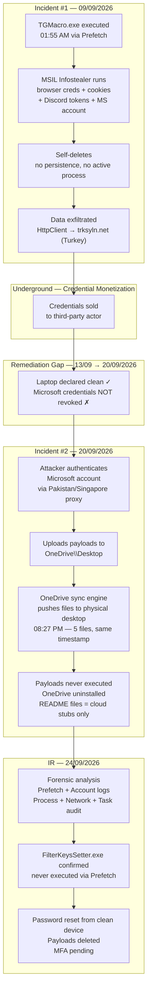

# 04 — Microsoft Account Compromise & OneDrive Payload Delivery

> ⚠️ **Real Case** — Sensitive information has been redacted to protect the victim and prevent retaliation. Published for educational and portfolio purposes only. Continuation of Case E.H. — Incident #1.

---

## Overview

| Field | Details |
|---|---|
| **Case** | E.H. — Incident #2 |
| **Date Detected** | September 20, 2026 |
| **Date Analyzed** | September 24, 2026 |
| **Type** | Account Compromise → Cloud-Based Payload Delivery |
| **Analyst** | Israel Bracamontes (I.S.B.) |
| **Status** | Resolved |

---

## Attack Chain — Full Two-Incident Timeline



---

## Background — Incident #1

On September 9, 2026, the victim executed `TGMacro.exe` — a trojanized Roblox macro distributed through Discord gaming servers. The malware, classified as `TScope.Trojan.MSIL`, was a one-shot infostealer that exfiltrated browser credentials, session cookies, and Discord tokens to `trksyln.net` (C2 operated from Turkey) before self-deleting, leaving no persistent process on disk. Among the credentials stolen was the victim's Microsoft account password, captured from the browser's saved password store. The laptop was declared clean after static analysis confirmed no active malware or persistence mechanisms — but the Microsoft credentials were never revoked or invalidated, turning a closed incident into the entry point for Incident #2.

**Key facts from Incident #1:**
- Victim compromised via a trojanized Roblox macro (`TGMacro.exe`) — execution confirmed in Windows Prefetch: **09/09/2026 at 01:55 AM**
- Malware type: MSIL one-shot infostealer. Stole browser credentials, session cookies, and Discord tokens, then self-deleted
- Among the stolen credentials: **victim's Microsoft account**
- Laptop was declared clean post-analysis. Pending actions (full format, dynamic analysis with dnSpy) were never completed
- The unrevoked Microsoft credentials became the entry point for Incident #2

---

## Timeline

| Date & Time | Event | Significance |
|---|---|---|
| 09/09/2026 01:55 AM | `TGMacro.exe` executed | Confirmed via Prefetch — credential theft begins |
| 13/09/2026 | Incident #1 detected and documented | Laptop declared "clean" — Microsoft credentials not revoked |
| 14–15/09/2026 | RustDesk executed (×2) | **Legitimate** — remote IR session by analyst from Kali Linux |
| 20/09/2026 08:27 PM | 5 payloads appear on desktop simultaneously | Identical timestamp, identical size (1.29 MB each) — OneDrive sync event |
| 21/09/2026 12:37 AM | Unusual activity detected — Pakistan (×2), Singapore | Attacker verifying successful sync |
| 21/09/2026 06:20 AM – 08:42 PM | Successful sign-ins from Singapore, Germany, UK | Multi-country proxy pattern — same actor |
| 22/09/2026 | Sextortion email received — **discarded** | Generic spam template — unrelated to the real compromise |
| 22/09/2026 10:32 PM | Successful sign-in from United States | Attacker continues active access |
| 24/09/2026 | Full IR, cleanup, password reset | Case closed |

---

## Attack Vector

### Cloud-as-Delivery-Channel

Incident #1 required the victim to click and execute a file — a step that antivirus, user hesitation, or link-inspection could potentially intercept. In Incident #2, the attacker had already done the hard part: they owned a working set of credentials. No additional social engineering was needed.

The attacker authenticated directly into the victim's Microsoft account and uploaded the payloads to `OneDrive\Desktop`. The OneDrive sync engine — a legitimate, trusted system service — then silently pushed those files to the physical desktop. From the victim's perspective, the files simply appeared. No link was clicked, no email was opened, no prompt was accepted.

This delivery method is stealthier than a new phishing link for two independent reasons. First, it requires **zero interaction** from the victim: OneDrive runs in the background and syncs automatically. Second, the files arrive from a trusted source — the victim's own Microsoft cloud storage — which bypasses link-inspection tools, email filters, and user suspicion entirely. A file that "appeared on my desktop from my own OneDrive" reads as a sync artifact, not a malicious delivery.

OneDrive was the logical choice over sending a new phishing email precisely because it eliminates the victim's decision entirely. The attacker already had cloud write access — using it as a delivery channel is the minimal-resistance path.

**Technical breakdown:**

1. Attacker authenticated into victim's Microsoft account using credentials from Incident #1
2. Uploaded `FilterKeysSetter.exe` and `README-[1-5].exe` directly to `OneDrive\Desktop`
3. OneDrive sync engine pushed the files to the physical desktop
4. At time of analysis, OneDrive had been uninstalled — but `FileCoAuth.exe` (Office co-authoring component) was still running and connected to Microsoft Azure (`52.168.117.171:443`)
5. Because OneDrive sync was not fully active, the README payloads were **cloud-only stubs** — never downloaded to local disk

---

## Forensic Analysis

### Windows Prefetch

**Tool:** `Get-ChildItem C:\Windows\Prefetch | Sort-Object LastWriteTime -Descending`

Prefetch records executable names and last run timestamps independently of the Windows Event Log. Critical when process creation auditing is disabled (see §Audit Policy below).

| Executable | Last Run | Verdict |
|---|---|---|
| `FILTERKEYSS ETTER.EXE` | Not present | ✅ Never executed — file was on disk but never launched |
| `README-[1-5].EXE` | Not present | ✅ Never executed — cloud-only stubs, never downloaded locally |
| `TGMACRO.EXE` | 09/09/2026 01:55 AM | ⚠️ Confirms real execution date from Incident #1 |
| `RUSTDESK.EXE` | 14–15/09/2026 | ✅ Legitimate — analyst's remote IR tool |

---

### Microsoft Account Activity Logs

**Source:** `account.microsoft.com → Security → Recent activity`

| Date & Time | Event | Country | Verdict |
|---|---|---|---|
| 21/09/2026 12:37 AM | Unusual activity detected | Pakistan (×2) | 🔴 Attacker |
| 21/09/2026 12:37 AM | Unusual activity detected | Singapore | 🔴 Attacker |
| 21/09/2026 06:20 AM | Successful sign-in | Singapore | 🔴 Attacker |
| 21/09/2026 08:32 PM | Successful sign-in | Germany | 🔴 Attacker |
| 21/09/2026 08:42 PM | Successful sign-in | United Kingdom | 🔴 Attacker |
| 22/09/2026 10:32 PM | Successful sign-in | United States | 🔴 Attacker |
| 22/09/2026 11:15 PM | Successful sign-in | Mexico | ✅ Victim |
| 24/09/2026 | Successful password reset | Mexico | ✅ IR — Remediation |

No single attacker physically traveled between Pakistan, Singapore, Germany, the UK, and the US across the same session. The pattern reveals the use of a **multi-hop proxy infrastructure** — almost certainly a commercial proxy network or botnet, where each authentication request exits through a different country's compromised node. This serves two purposes: it defeats IP-based anomaly detection systems that flag logins from a single foreign IP, and it obscures the attacker's true geographic origin.

This is the same evasion technique identified in Incident #1, where the stolen credentials were monetized from Ulyanovsk (Russia), Spain, and Egypt through different proxies — all the same credential set, all the same operator. The multi-country pattern across both incidents, combined with the shared C2 domain (`trksyln.net`), strongly suggests the credentials were purchased from a stealer log market and the buyer uses structured proxy infrastructure to avoid detection while working through multiple compromised accounts.

---

### Process & Network Analysis

**Tools:** `Get-Process | Select-Object Name, Id, Path` and `netstat -ano | findstr "ESTABLISHED"`

All running processes were verified against known-good signatures. All external network connections were cross-referenced with PIDs:

| Connection | IP | Service | PID | Verdict |
|---|---|---|---|---|
| `192.168.1.116:2322` | `3.213.93.69:443` | Epic Games (AWS) | 15632 | ✅ Legitimate |
| `192.168.1.116:4035` | `52.168.117.171:443` | Microsoft OneDrive (Azure) | 11276 (FileCoAuth) | ⚠️ OneDrive remnant |
| `192.168.1.116:25612` | `162.159.135.234:443` | Discord (Cloudflare) | 10800 | ✅ Legitimate |

**Result:** No malicious processes active at time of analysis. Stealer model confirmed — payload arrived but did not execute.

---

### Scheduled Tasks — LOLBin Analysis & False Positives

**Tool:** `Get-ScheduledTask | Where-Object {$_.State -ne "Disabled"}`

During analysis, an alternative AI tool (DeepSeek) flagged four scheduled tasks as malicious based solely on the use of Living-off-the-Land Binaries (LOLBins). Each was verified using `Get-AuthenticodeSignature`.

A LOLBin (Living-off-the-Land Binary) is a legitimate, Microsoft-signed Windows executable that can theoretically be abused by attackers to run arbitrary code while avoiding detection — `rundll32.exe`, `sc.exe`, `mshta.exe`, and `certutil.exe` are common examples. The key word is *theoretically*: their presence in a scheduled task is a hypothesis, not a finding.

The correct verification process requires three steps, in order:
1. **Check the full task path** — a task created by Windows lives under `\Microsoft\Windows\<subfolder>\`, not directly at `\`. A user-created `Proxy` task sitting at the root is suspicious; `\Microsoft\Windows\Autochk\Proxy` is a documented system task.
2. **Verify the digital signature** of every binary being called with `Get-AuthenticodeSignature`.
3. **Read the arguments in context** — `/d acproxy.dll,PerformAutochkOperations` is a documented Windows auto-check disk operation, not obfuscated shellcode.

DeepSeek's methodological mistake was flagging at the binary name level — it saw `rundll32.exe` and marked the task as malicious without checking the full path or signature. The `acproxy.dll` case is the clearest illustration: `rundll32.exe` is used by Windows itself constantly for legitimate DLL-hosted operations. Flagging every `rundll32.exe` invocation as a LOLBin threat is equivalent to flagging every `cmd.exe` process as malware. It produces noise, not signal.

| Task Name | Executable | Arguments | Real Verdict |
|---|---|---|---|
| `Proxy` | `rundll32.exe` | `/d acproxy.dll,PerformAutochkOperations` | ✅ Legitimate — `\Microsoft\Windows\Autochk\Proxy`, valid MS signature |
| `LoginCheck` | `sc.exe` | `start pushtoinstall login` | ✅ Legitimate — `\Microsoft\Windows\PushToInstall\LoginCheck` |
| `MareBackup` | `compattelrunner.exe` | Windows Telemetry args | ✅ Legitimate — MS Compatibility Telemetry (Huawei label) |
| `ModifyLinkUpdate` | `InstallManagerApp.exe` | `-UpdateCurrentUser` | ✅ Legitimate — AMD driver updater |

**Verification command used:**
```powershell
Get-AuthenticodeSignature "C:\Windows\System32\acproxy.dll"
# Result: Status = Valid | Signer = Microsoft Corporation
```

---

### Audit Policy — Missing Event Log

```cmd
auditpol /get /category:*
# Creación del proceso: Sin auditoría
```

Process creation logging (Event ID 4688) was **disabled** — a default configuration on consumer Windows installs. This meant the Security event log had no record of any process execution: no timestamp, no command line, no parent-child relationships. The analyst arrived after a one-shot stealer had already run and self-deleted, with no audit trail to confirm it.

The Windows Prefetch cache was used as an alternative source of execution evidence. Prefetch exists for performance reasons — Windows pre-loads frequently used binaries into memory — but has the forensically useful side effect of recording that a binary ran and its most recent execution timestamp. It's not auditing infrastructure, but on a home endpoint, it's often the only source of execution evidence.

The difference on a corporate endpoint is significant. **Sysmon** (Event ID 1 — Process Create) with a properly tuned configuration captures full process command lines, parent-child relationships, hashes, and network connections in real time, regardless of the native audit policy. An **EDR** adds behavioral analysis, memory injection detection, and cloud telemetry on top of that. At minimum, enforcing process creation auditing via GPO (`auditpol /set /subcategory:"Process Creation" /success:enable`) produces Event ID 4688 at zero cost — it's a configuration change, not additional software. On this endpoint, none of that was in place, which is why Prefetch had to carry the evidentiary weight.

---

## Malware Analysis

### FilterKeysSetter.exe

| Property | Value |
|---|---|
| **SHA-256** | `1C838C8D8FFF838CDB583CF76FF61C8002DF9BE7D617DA6094175D4D78697023` |
| **Size** | 1.29 MB |
| **Location** | `C:\Users\[REDACTED]\OneDrive\Desktop\FilterKeysSetter.exe` |
| **VirusTotal** | 1/70 — ANY.RUN verdict: **Malicious activity** |
| **Executed?** | No — absent from Windows Prefetch |
| **Delivery** | OneDrive sync from compromised Microsoft account |

`FilterKeysSetter` is the name of a legitimate open-source keyboard remapping tool (by Soarer) widely used in the gaming and mechanical keyboard community to remap legacy HID device keys. Attackers deliberately choose names of real, functional tools for their payloads because those names are already indexed as clean in many security databases, and they don't raise suspicion in a user's file system — especially on a gamer's machine where a "keyboard setter" utility is entirely plausible.

This technique is classified under MITRE ATT&CK as **T1036 — Masquerading**: using a filename that implies legitimate, expected software to blend into a normal-looking environment.

According to the ANY.RUN sandbox analysis, the sample (SHA-256: `1C838C8D8FFF838CDB583CF76FF61C8002DF9BE7D617DA6094175D4D78697023`) exhibited **malicious network activity** despite its 1/70 detection rate on VirusTotal. The low detection rate is consistent with a recently compiled payload or a slightly modified variant — both common strategies to stay below AV thresholds. Had it executed on this machine, it would likely have established persistence or acted as a second-stage downloader, given that the attacker already had full Microsoft account access and knowledge of the target (the victim's system was known from Incident #1).

---

### README-[1-5].exe

| Property | Value |
|---|---|
| **Count** | 5 identical files |
| **Timestamp** | 20/09/2026 08:27 PM (all identical — same sync event) |
| **Size** | 1.29 MB each |
| **Hash** | Not obtainable — cloud-only stubs (OneDrive not running) |
| **Error** | `"El proveedor de archivos de nube no se está ejecutando"` |
| **Executed?** | No — not downloaded to local disk |

The simultaneous appearance of 5 identical files at the exact same second is inconsistent with a dropper replicating locally — local self-replication runs on the victim machine and is subject to execution timing and file I/O overhead, producing measurably different timestamps. Five files appearing with identical timestamps to the second points to a **bulk upload event from the attacker's side**: 5 files uploaded together in one operation, all timestamped at the moment the OneDrive sync engine registered the incoming sync.

The most likely hypothesis is that these are 5 copies of the same payload uploaded simultaneously, either as redundancy (so that deleting one or two leaves the rest intact) or because the attacker runs a templated batch-upload workflow when deploying to multiple victims. "README" is a deliberate social engineering choice: README files are associated with documentation and expected in software distributions, not flagged as executables by most users. A gamer who sees 5 "README" files on their desktop after a new game install might not immediately register them as `.exe` files.

**Caveat:** Because OneDrive was not running at the time of analysis, none of the README files were ever fully downloaded to local disk — they remain cloud-only stubs. No hash was obtainable and the behavior hypothesis cannot be confirmed from static analysis alone. Dynamic analysis would require re-syncing OneDrive in an isolated environment.

---

## IOCs

| Type | Value | Context |
|---|---|---|
| `SHA-256` | `1C838C8D8FFF838CDB583CF76FF61C8002DF9BE7D617DA6094175D4D78697023` | FilterKeysSetter.exe — confirmed malicious |
| `FILENAME` | `FilterKeysSetter.exe` | Masquerades as legitimate keyboard tool |
| `FILENAME` | `README-[1-5].exe` | Cloud-delivered payloads, never executed |
| `DOMAIN` | `t█████n.net` | Attacker C2 infrastructure (Incident #1 & #2) |
| `GEO` | Pakistan, Singapore, Germany, UK, United States | Proxy countries used to access Microsoft account |
| `TIMESTAMP` | `20/09/2026 08:27 PM` | Mass sync event — all payloads same second |

---

## MITRE ATT&CK Mapping

| Tactic | Technique | ID | Description |
|---|---|---|---|
| Initial Access | Valid Accounts | T1078 | Used stolen Microsoft credentials from Incident #1 |
| Lateral Movement | Transfer Data to Cloud Account | T1537 | Uploaded payloads to victim's OneDrive |
| Defense Evasion | Masquerading | T1036 | `FilterKeysSetter.exe` mimics a legitimate tool |
| Defense Evasion | Living off the Land | T1218 | `rundll32.exe`, `sc.exe` found in scheduled tasks (false positives — verified clean) |
| Persistence | Scheduled Task (attempted) | T1053 | Payload designed to run on next OneDrive sync |
| Command & Control | Multi-hop Proxy | T1090.003 | Login attempts from Pakistan, Singapore, Germany, UK, US in same session |

---

## Remediation

| Action | Method | Status |
|---|---|---|
| Delete `FilterKeysSetter.exe` | `Remove-Item ... -Force` | ✅ Completed |
| Delete `README-[1-5].exe` | `Remove-Item ... -Force` | ✅ Completed |
| Microsoft account password reset | `account.microsoft.com` from clean device | ✅ Completed |
| Enable MFA on Microsoft account | Microsoft Authenticator | ⚠️ Pending — Critical |
| Full OneDrive uninstall | `OneDriveSetup.exe /uninstall` | ⚠️ Pending |
| Full laptop format | Windows reinstall | Recommended |

---

## Lessons Learned

**1. Incident #1 had a critical remediation gap — "clean laptop" ≠ "safe credentials."**
The laptop was declared clean because static analysis confirmed no active malware or persistence mechanisms. That assessment was correct for the machine. But the infostealer's entire job was to exfiltrate data and disappear — and it succeeded. Declaring the incident closed without revoking every credential that could have been captured (everything in the browser password manager, every active session cookie, every token) was the direct cause of Incident #2. A complete incident response is: malware removed *and* every potentially exposed credential rotated. One without the other is a half-closed loop.

**2. MFA on cloud accounts is not optional after a credential theft.**
A password can be stolen, but a password alone is also replaceable. The problem is the window between when a password is stolen and when it's changed — during that gap, the attacker has full access. MFA would have stopped this compromise entirely: even with the correct password, the attacker couldn't authenticate without the second factor. For accounts that have filesystem write access (OneDrive, Google Drive, Dropbox), this is especially critical. A compromised cloud account is a direct, trusted write path to the victim's machine. Not a theoretical risk — this incident is the demonstration.

**3. LOLBin ≠ malware. Verification requires: full task path + digital signature + arguments in context.**
An AI tool flagged four legitimate Windows scheduled tasks as malicious based solely on the presence of `rundll32.exe` and `sc.exe`. Both of these are used constantly by Windows itself for completely benign operations. The correct verification is: (1) check the full task path — `\Microsoft\Windows\Autochk\Proxy` is not the same as `\Proxy`; (2) verify the digital signature of the called binary; (3) read the arguments in full context. Automated tools, including AI-assisted ones, pattern-match on binary names and produce false positives at a rate that generates noise rather than signal. Every LOLBin flag is a hypothesis that requires manual verification — not a confirmed finding.

**4. Windows Prefetch was more useful than the Event Log — because process creation auditing wasn't enabled.**
Consumer Windows doesn't log process creation by default. The Security event log was empty for the entire relevant period. Prefetch existed, had valid timestamps, and confirmed `TGMacro.exe` execution (Incident #1) and the absence of `FilterKeysSetter.exe` execution (Incident #2) — exactly the evidence needed. Prefetch is not designed for forensics, but on an unaudited home endpoint, it's often the only source of execution truth. On a corporate endpoint with Sysmon or an EDR deployed, this same investigation would have had full process creation logs, command line arguments, parent-child relationships, and network connections for every execution.

**5. The correct IR sequence: revoke credentials first, then analyze — not the other way around.**
The natural instinct is to investigate thoroughly before making changes, to avoid disrupting evidence. That's correct for a static system. It's wrong for a live cloud account that an attacker is actively using. In this case, the attacker made four successful sign-ins over three days while investigation was pending. The right sequence after a confirmed credential theft is: (1) immediately revoke/rotate all exposed credentials (stop the bleeding), (2) enable MFA on every affected account, (3) then proceed with forensic analysis from a clean device. Speed of credential revocation is more protective than comprehensive pre-revocation analysis.

---

*Case E.H. · Incident Response #002 · September 2026 · Sensitive data redacted — educational/portfolio use only*
